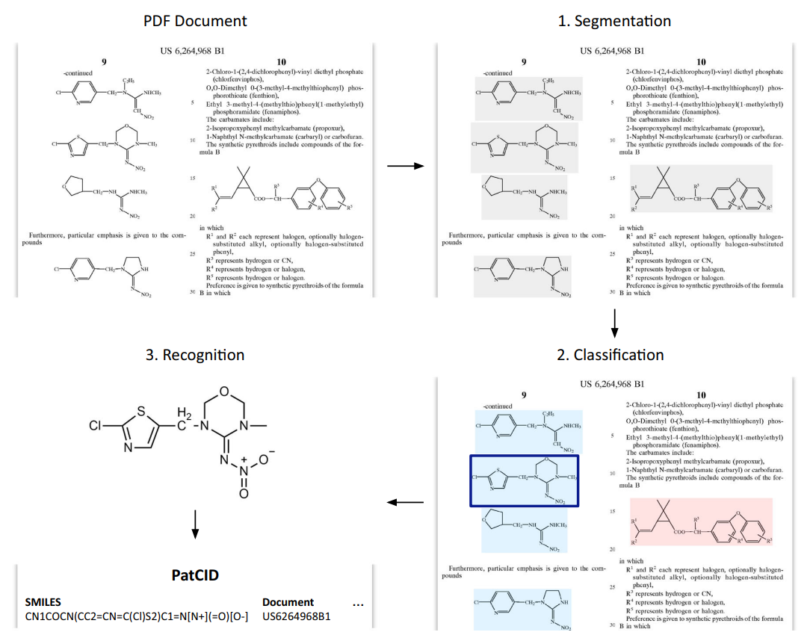

# MolClassifier

MolClassifier is a model to classify chemical images into categories: "Clean" (corresponding to Molecular Structure), "Markush" (corresponding to Markush structure) and "Trash" (corresponding to Background).
MolClassifier is presented in [PatCID: an open-access dataset of chemical structures in patent documents](https://www.nature.com/articles/s41467-024-50779-y).



## Installation 

Ensure your distribution has Python version 3.11:
```
python3 --version
pip3 -V
```

Install poetry
```
pip install poetry
```

Install the dependencies
```
poetry install
```

## Model 

```
wget https://huggingface.co/ds4sd/MolClassifier/resolve/main/models/molclassifier_model.chpt -P ./data/models/
```

## Inference

- Place the images to annotate in `./data/dataset/`

- Run the model
  ```
  poetry run python ./mol_classifier/classifier.py infer --dir ./data/dataset/ --checkpoint ./data/models/molclassifier_model.chpt --output ./data/output.txt
  ```

- Read predictions in `./data/output.txt`

### Datasets

The training and validation datasets are available on [Zenodo](https://zenodo.org/records/10978564).
